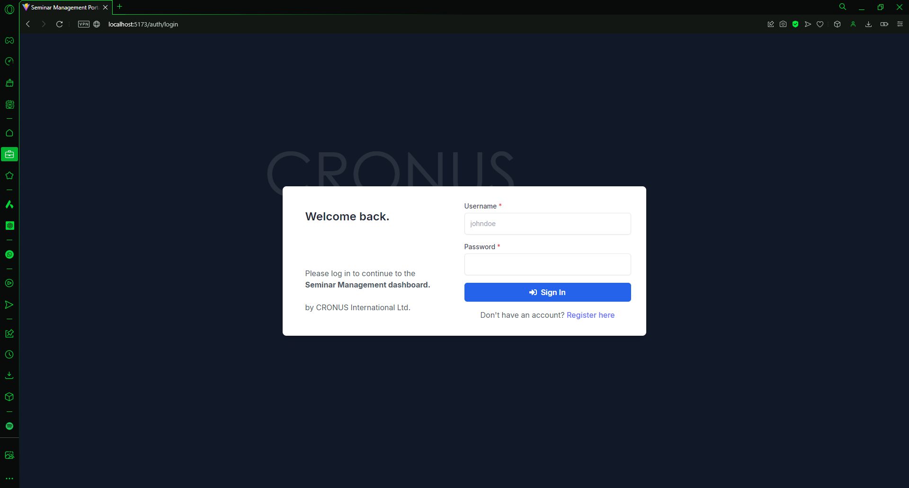
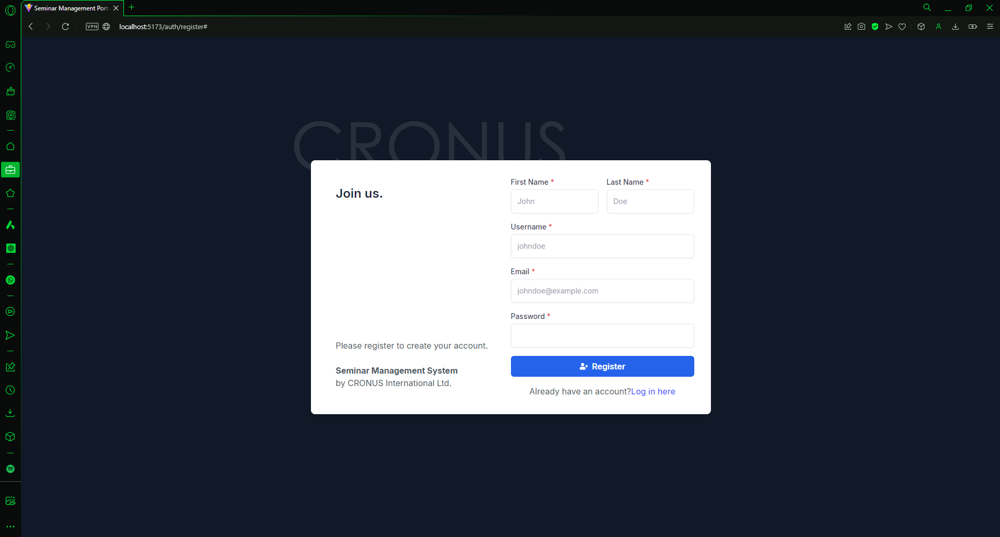
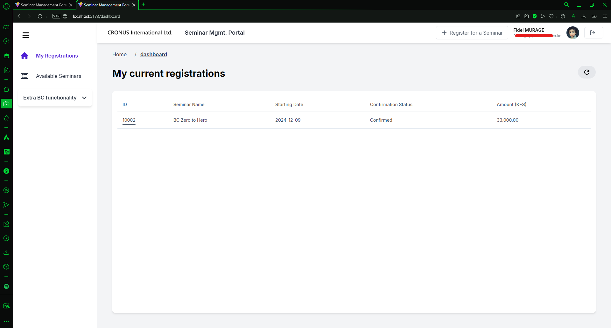
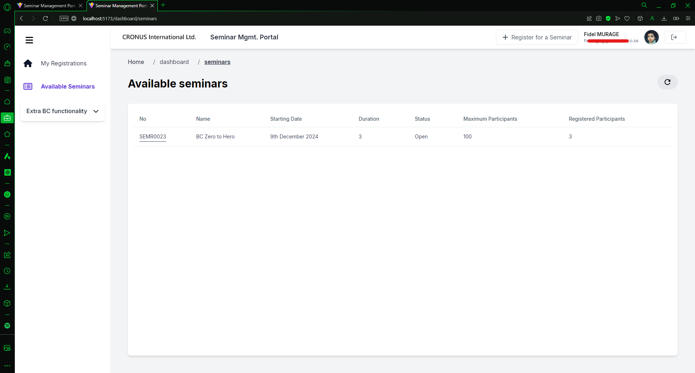
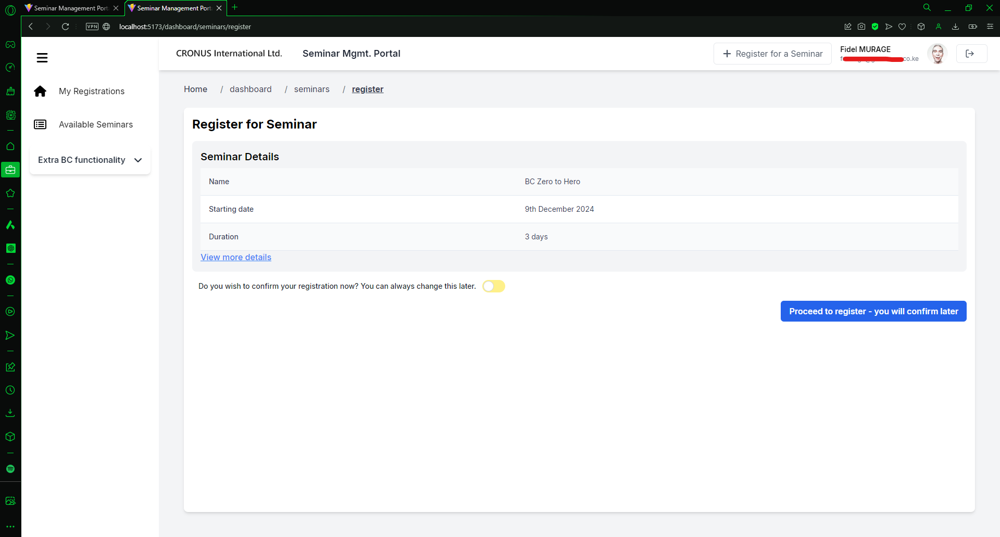
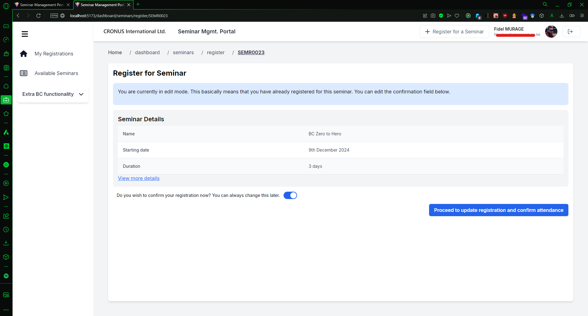

# Seminar Management Portal

The Seminar Management Portal is a web application designed to manage seminar registrations. This system exposes
Microsoft Business Central (BC) functionality through a .NET-Core 8 backend. All functionality in this portal depends on
the logic implemented in the backend.

## Table of Contents

- [Features](#features)
- [Technologies Used](#technologies-used)
- [Installation](#installation)
- [Usage](#usage)
- [Screenshots](#screenshots)
- [Contributing](#contributing)
- [License](#license)

## Features

- User authentication and authorization
- Seminar registration and management
- Edit and update existing registrations
- View seminar details
- Confirmation of seminar attendance

## Technologies Used

- **Frontend:**
    - TypeScript
    - JavaScript
    - React
    - Formik
    - Yup

- **Backend:**
    - .NET-Core 8
    - Microsoft Business Central

- **Other Tools:**
    - npm
    - WebStorm IDE

## Installation

To set up the project locally, follow these steps:

1. Clone the repository:
    ```sh
    git clone https://github.com/your-username/seminar-management-portal.git
    cd seminar-management-portal
    ```

2. Install the dependencies:
    ```sh
    npm install
    ```

3. Start the development server:
    ```sh
    npm start
    ```

4. Open your browser and navigate to `http://localhost:3000`.

## Usage

1. **Register for a Seminar:**
    - Select a seminar from the dropdown list.
    - Fill in the required details.
    - Submit the form to register.

2. **Edit an Existing Registration:**
    - Navigate to the seminar you have registered for.
    - Edit the confirmation status or other details.
    - Submit the form to update the registration.

3. **View Seminar Details:**
    - Click on the seminar name to view more details about the seminar.

## Screenshots

### Login page



### Registration page



### Dashboard (My Current Registrations)



### Available Seminars



### Seminar Registration



### Update Registration



## Contributing

Contributions are welcome! Please follow these steps to contribute:

1. Fork the repository.
2. Create a new branch (`git checkout -b feature-branch`).
3. Make your changes.
4. Commit your changes (`git commit -m 'Add some feature'`).
5. Push to the branch (`git push origin feature-branch`).
6. Open a pull request.

## License

This project is licensed under the MIT License. See the [LICENSE](LICENSE) file for details.

## Backend

The backend for this project can be found [here](https://github.com/murageh/SeminarApp-v1-NET-Core).